<div align="center">

# 🥊 Kanbrawl

**A minimal live kanban board built for AI agents**

[](https://github.com/sinedied/kanbrawl/actions/workflows/ci.yml)
[](https://www.typescriptlang.org)
[](https://expressjs.com)
[](https://lit.dev)
[](https://nodejs.org)
[](LICENSE)

[Features](#features) · [Getting Started](#getting-started) · [Configuration](#configuration) · [MCP Tools](#mcp-tools) · [Architecture](#architecture) · [Development](#development)

</div>

---

AI agents manage tasks on a kanban board through [MCP](https://modelcontextprotocol.io) tools. Humans follow along in a live web UI that updates in real-time via Server-Sent Events. Both agents and humans can create, edit, move, and delete tasks — all changes sync instantly.

## Features

- 🤖 **MCP Server** — Exposes kanban operations as MCP tools via Streamable HTTP
- 🖥️ **Live Web UI** — Lit 3 web components with real-time SSE updates and drag-and-drop
- 🎨 **Dark & Light themes** — Switch themes from the UI or set a default in config
- 📄 **Single JSON file** — All board config and task data lives in `kanbrawl.json`
- 🔧 **Customizable columns** — Configure column names and count to fit your workflow
- 🏷️ **Task priority** — P0 (critical), P1 (normal), P2 (low) with visual badges
- 👤 **Assignee tracking** — Assign tasks to agents or team members by name
- 🔄 **Real-time sync** — Changes from agents or the UI propagate to all connected clients
- 📦 **Zero infrastructure** — No database, no external services

## Getting Started

### Prerequisites

- [Node.js](https://nodejs.org) >= 22

### Quick Start

```bash
npm install
npm run build
npm start
```

Open [http://localhost:3000](http://localhost:3000) to view the board.

A default `kanbrawl.json` is created automatically on first run.

### Connect an AI Agent

Add the following to your MCP client configuration (e.g. VS Code, Claude Desktop):

```json
{
  "mcpServers": {
    "kanbrawl": {
      "type": "streamable-http",
      "url": "http://localhost:3000/mcp"
    }
  }
}
```

The agent can then use MCP tools to interact with the board.

## Configuration

All configuration and data is stored in `kanbrawl.json`, auto-created on first run:

```json
{
  "columns": ["Todo", "In progress", "Blocked", "Done"],
  "theme": "dark",
  "tasks": []
}
```

| Field | Type | Default | Description |
|-------|------|---------|-------------|
| `columns` | `string[]` | `["Todo", "In progress", "Blocked", "Done"]` | Column names and order |
| `theme` | `"light"` \| `"dark"` | System preference | UI theme override |
| `tasks` | `Task[]` | `[]` | Task objects (managed by the app) |

> [!TIP]
> Edit the `columns` array to customize your board layout. Changes take effect on restart.

## MCP Tools

All tools are available via the `/mcp` endpoint.

| Tool | Description | Read-only |
|------|-------------|-----------|
| `get_columns` | Get columns with task counts | ✅ |
| `list_tasks` | List tasks, filtered by column (default: first) and priority | ✅ |
| `create_task` | Create a new task (with priority, assignee) | ❌ |
| `move_task` | Move a task to a different column | ❌ |
| `update_task` | Update task fields (title, description, priority, assignee) | ❌ |
| `delete_task` | Delete a task | ❌ |

## Architecture

```mermaid
graph LR
  subgraph Clients
    A["🤖 AI Agents"]
    B["🖥️ Web Browser"]
  end

  subgraph Server ["Express 5 Server"]
    MCP["MCP Endpoint<br/><code>/mcp</code>"]
    API["REST API<br/><code>/api/*</code>"]
    SSE["SSE Endpoint<br/><code>/events</code>"]
    Store["BoardStore"]
  end

  DB[("kanbrawl.json")]

  A -- "MCP tools<br/>(Streamable HTTP)" --> MCP
  B -- "REST calls" --> API
  B -. "real-time events" .-o SSE

  MCP --> Store
  API --> Store
  Store -- "read/write" --> DB
  Store -- "emit events" --> SSE
```



**How it works:**

1. **AI agents** call MCP tools (e.g. `create_task`) via the `/mcp` Streamable HTTP endpoint
2. **Humans** interact through the web UI, which calls the REST API at `/api/*`
3. All mutations flow through the **BoardStore**, which persists data to `kanbrawl.json` and emits change events
4. The **SSE manager** broadcasts events to all connected browser clients for real-time updates

## Development

### Dev Mode

Runs the Express server with auto-reload and Vite dev server with HMR:

```bash
npm run dev
```

| Service | URL | Description |
|---------|-----|-------------|
| Server | [localhost:3000](http://localhost:3000) | API, MCP, SSE |
| Client | [localhost:5173](http://localhost:5173) | Vite dev with proxy |

### Build

```bash
npm run build          # Build both server and client
npm run build:server   # Build server only (tsc)
npm run build:client   # Build client only (vite)
npm run clean          # Remove dist/
```

